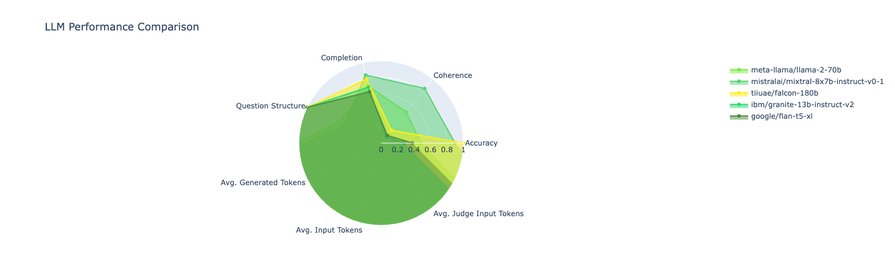

# LLM Judge

This Python application leverages language models (LLMs) to generate and judge responses for Jeopardy-style questions. It uses a combination of database operations and multiprocessing to efficiently process batches of prompts and generate answers using different LLMs. 

In this package, you can use jeopardy dataset from HuggingFace and prompts to evaluate your models with LLM-as-a-judge.
To automate the evaluation process, we prompt strong LLMs like GPT-4 to act as judges and assess the quality of the models' responses.


## Features
- Prompt Generation: Converts Jeopardy questions from a database into prompts suitable for LLMs.
- Batch Processing: Processes questions in batches to optimize the load on system resources.
- Answer Generation: Utilizes specified LLMs to generate answers for the given prompts.
- Database Integration: Stores questions, answers, and other relevant data in a SQLite database for persistence and retrieval.
- Multiprocessing Support: Leverages Python's multiprocess module to parallelize answer generation.

## Contents
- [Install](#install)


## Install
```
git clone github.com:manavgup/jeopardy-llm.git
cd v2.0
pip install -r requirements.txt
```

## Generate Jeopardy Answers
TODO: Remove jeopardy dataset and just load from HF.

To generate the jeopardy answers, use:

```
python3 gen_jeopardy.py --models_file data/models.jsonl --questions_file data/questions.jsonl --db_file output/jeopardy.db
```
### Command Line Arguments
- --models_file: Path to the JSONL file containing LLM configurations.
- --questions_file: Path to the JSONL file containing the Jeopardy questions.
- --db_file: Path to the SQLite database file.
- --judge-model-id: (Optional) ID of the judge model to use for generating judgments.
- --test-run-id: (Optional) ID of the test run to use for generating judgments.

## Generate Judgements
This Python script, gen_judgement.py, facilitates the evaluation of answers generated by Language Learning Models (LLMs) for Jeopardy-style questions using a variety of judges like Anthropic Claude and GPT-4. The system stores and manages data through a SQLite database and allows users to specify which model to use for judging.

### Features
- Judge Integration: Support for multiple judgement models, allowing responses to be evaluated based on predefined criteria.
- Database Operations: Integrates with a SQLite database to fetch LLM responses and store judgement results.
- Flexible Judging: Allows specifying which LLM's responses to judge and supports using specific test runs for a more targeted approach.

To use LLM-as-judge, use:

```
python3 gen_judgement.py --db_file output/jeopardy.db --
```

## LLM Response Viewer and Judgement Interface

This Python script, view_responses.py, uses Gradio to provide an interactive web interface for displaying and judging responses generated by Language Learning Models (LLMs) for Jeopardy-style questions. It integrates with a database to fetch responses and supports generating visual performance comparisons using Plotly.

### Features
- Interactive Web Interface: Uses Gradio to create a user-friendly interface for interaction with LLM responses and judge ratings.
- Dynamic Data Fetching: Retrieves data from a SQLite database dynamically based on user inputs.
- Judgement Functionality: Allows users to generate judgements for specific LLM responses using selected judge models.
- Performance Visualization: Generates spider charts to visually compare LLM performance on various metrics using Plotly.

### Usage
```
python view_responses.py
```

If all goes well, you should see a radar plot as follows:

